# 💫 About Me
<h1 align="center">👋 Hey there, everyone!</h1> 
👦 I'm Low 
📚 Currently a student at 42 Kuala Lumpur 
🧑‍💻 I enjoy learning new tech and building cool stuff  

 

# 💻 Tech Stack

## 🧑‍💻 Programming Languages

## ⚙️ Frameworks & Libraries

## 🛠 Tools & Infrastructure

 

# 📚 Project
| Project | Description |
|-------------|-------------|
| [**expenses_tracker**](https://github.com/wenjuin95/Expenses_Tracker) | A command-line Expenses Tracker application written in Java. |
| [**dev_container**](https://github.com/wenjuin95/dev-container) | A collection of ready-to-use VS Code Dev Containers for different programming languages, allowing developers to start coding instantly without installing local toolchains. |
| [**Workout_motion_detection**](https://github.com/wenjuin95/workout-motion-detection) | workout motion detection application that uses computer vision to track arm movements and count repetitions |
| [**Ft_trancendence**](https://github.com/exellaz/ft_transcendence) | showcases the complete development of a modern full-stack web application from scratch. It brings together real-time communication, secure authentication, responsive UI, multiplayer game logic, database management, and deployment | 
| [**Webserver**](https://github.com/exellaz/webserv) | make a server with C++98 | 
| [**Cub3D**](https://github.com/wenjuin95/3D-MAZE) | make a dynamic view inside a maze with ray-casting |
| [**Desktop_Tool**](https://github.com/wenjuin95/desktop_tool) | just a tool that help me to track where my app, website and folder |
 

# 🌐 Social
 

 

# 📊 GitHub Stats

<!-- Proudly created with GPRM ( https://gprm.itsvg.in ) -->
