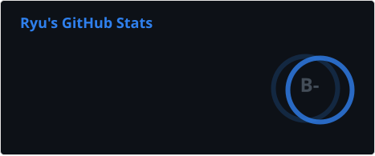
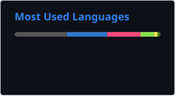

# 💫 About Me
<h1 align="center">👋 Hey there, everyone!</h1> 
👦 I'm Low 
📚 Currently a student at 42 Kuala Lumpur 
🤖 Aspiring AI Engineer focused on integrating machine learning with robust software systems 
🧑‍💻 I enjoy building intelligent applications, from computer vision tools to automated AI workflows  

 

# 💻 Tech Stack

### 🤖 AI & Machine Learning

| Focus Area | Technologies |
| :--- | :--- |
| **Vision ML** | OpenCV · MediaPipe |
| **AI Integration** | LLM APIs · Prompt Engineering · OCR |

### 🧑‍💻 Programming Languages

| Focus Area | Technologies |
| :--- | :--- |
| **Systems & Core** | C · C++ · Java · SQL |
| **Web & Scripting** | JavaScript · TypeScript · Python · HTML5 · CSS3 |

### ⚙️ Frameworks & Libraries

| Focus Area | Technologies |
| :--- | :--- |
| **Frontend** | React Native · Next.js |
| **Backend** | Node.js |

### 🛠 Tools & Infrastructure

| Focus Area | Technologies |
| :--- | :--- |
| **Databases** | MariaDB · SQLite · Prisma |
| **DevOps & Control** | Nginx · Docker |

 

# 📚 Project
| Project | Description |
|-------------|-------------|
| [**AI-Expense-Tracker**](https://github.com/wenjuin95/AI-Expense-Tracker) | An automated financial tool using OCR and AI to scan receipts, extract key data, and organize spending. |
| [**AI-code-review**](https://github.com/wenjuin95/AI-code-review) | A lightweight AI-assisted Pull Request reviewer.. |
| [**Malaysia Currency Exchange**](https://github.com/wenjuin95/MYR-Currency-Exchange) | a lightweight and ad-free currency exchange web application tailored specifically for the Malaysian market. |
| [**Workout_motion_detection**](https://github.com/wenjuin95/workout-motion-detection) | workout motion detection application that uses computer vision to track arm movements and count repetitions |
| [**Ft_trancendence**](https://github.com/wenjuin95/Ft_trancendence) | showcases the complete development of a modern full-stack web application from scratch. It brings together real-time communication, secure authentication, responsive UI, multiplayer game logic, database management, and deployment | 
| [**Cub3D**](https://github.com/wenjuin95/3D-MAZE) | make a dynamic view inside a maze with ray-casting |
| [**Inception**](https://github.com/wenjuin95/inception) | A hands-on implementation of a microservice-style architecture using Docker. Key features include custom-built images, TLS-secured NGINX, and managed volumes for database persistence |
| [**Webserver**](https://github.com/exellaz/webserv) | make a server with C++98 | 
| [**Desktop_Tool**](https://github.com/wenjuin95/desktop_tool) | just a tool that help me to track where my app, website and folder |
| [**dev_container**](https://github.com/wenjuin95/dev-container) | A collection of ready-to-use VS Code Dev Containers for different programming languages, allowing developers to start coding instantly without installing local toolchains. |
 

# 🌐 Social
 
 
 

 

# 📊 GitHub Stats
<!---- ---->

<!-- Proudly created with GPRM ( https://gprm.itsvg.in ) -->
